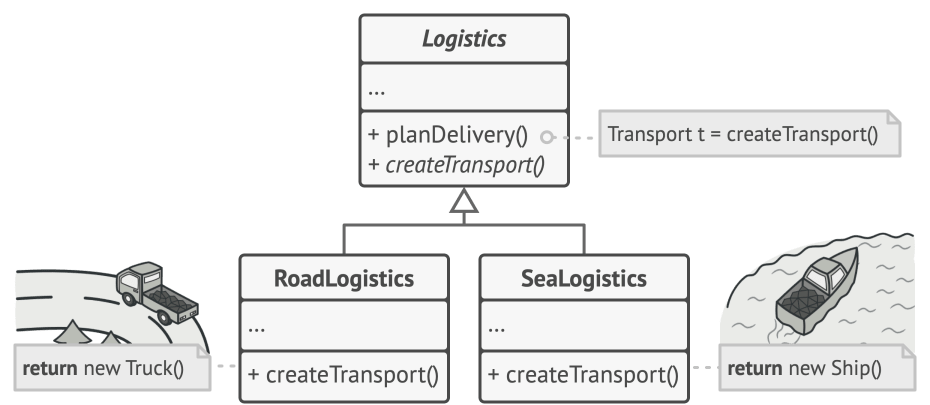
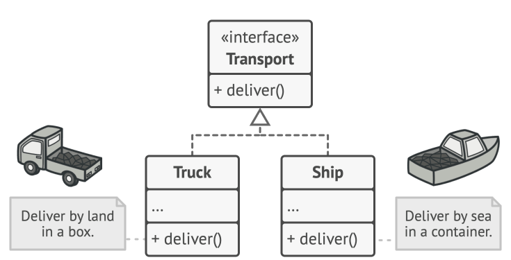
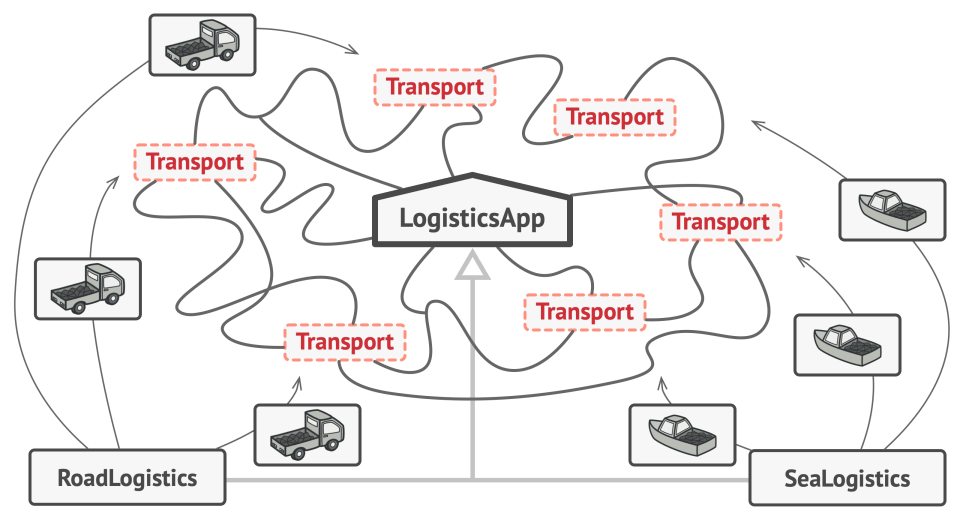
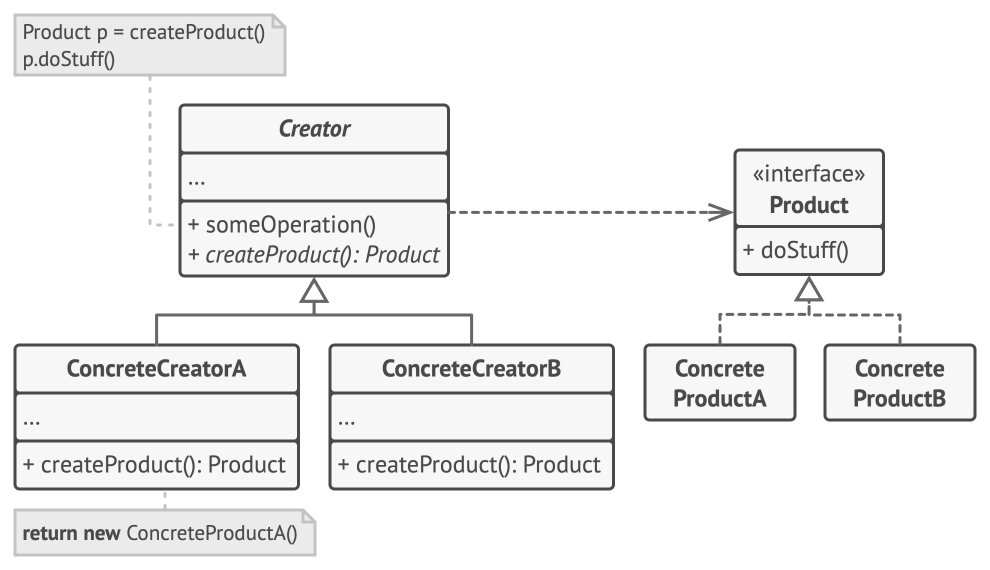

# Factory Method

Factory Method is a creational design pattern that provides an interface for creating objects in a superclass, but allows subclasses to alter the type of objects that will be created.

At the core of the Factory Method pattern is the concept of delegation. Instead of the client code directly creating objects, it delegates the responsibility to a Factory Method.

This method resides in an abstract Creator class or interface, defining an interface for creating objects. Concrete subclasses of the Creator implement this Factory Method, allowing them to create specific instances of objects. This delegation promotes loose coupling between the client code and the objects it uses, enhancing flexibility and maintainability.

**Idea of Factory Method**

- Normally, to create an object, we write: obj = SomeClass().

- With Factory Method, we do not create objects directly in your main code.

- Instead, we call a method (the “factory”) that creates the object for us.

So:

- Without factory:
    - Payment p = CreditCardPayment()

- With factory:
    - Payment p = PaymentFactory.create_payment("card")

The factory method hides which concrete class is used and centralizes the creation logic.

### Problem

Imagine that you’re creating a logistics management application. The first version of your app can only handle transportation by trucks, so the bulk of your code lives inside the Truck class.

After a while, your app becomes pretty popular. Each day you receive dozens of requests from sea transportation companies to incorporate sea logistics into the app.


*Figure: Adding a new class to the program isn’t that simple if the rest of the code is already coupled to existing classes.*

Great news, right? But how about the code? At present, most of your code is coupled to the Truck class. Adding Ships into the app would require making changes to the entire codebase. Moreover, if later you decide to add another type of transportation to the app, you will probably need to make all of these changes again.

As a result, you will end up with pretty nasty code, riddled with conditionals that switch the app’s behavior depending on the class of transportation objects.

### Solution

The Factory Method pattern suggests that you replace direct object construction calls (using the new operator) with calls to a special factory method. Don’t worry: the objects are still created via the new operator, but it’s being called from within the factory method. Objects returned by a factory method are often referred to as products.


*Figure: Subclasses can alter the class of objects being returned by the factory method.*

At first glance, this change may look pointless: we just moved the constructor call from one part of the program to another. However, consider this: now you can override the factory method in a subclass and change the class of products being created by the method.

There’s a slight limitation though: subclasses may return different types of products only if these products have a common base class or interface. Also, the factory method in the base class should have its return type declared as this interface.


*Figure: All products must follow the same interface.*

For example, both Truck and Ship classes should implement the Transport interface, which declares a method called deliver. Each class implements this method differently: trucks deliver cargo by land, ships deliver cargo by sea. The factory method in the RoadLogistics class returns truck objects, whereas the factory method in the SeaLogistics class returns ships.


*Figure: As long as all product classes implement a common interface, you can pass their objects to the client code without breaking it.*

The code that uses the factory method (often called the client code) doesn’t see a difference between the actual products returned by various subclasses. The client treats all the products as abstract Transport. The client knows that all transport objects are supposed to have the deliver method, but exactly how it works isn’t important to the client.

## Structure of Factory Method

The structure usually has 4 parts:

```text
Client
   |
   v
Creator (Factory)  ---> Concrete Creator ---> Product
                                                ^
                                                |
                                            Concrete Products
```



| Component        | What it is                                  | Real-life analogy         |
| ---------------- | ------------------------------------------- | ------------------------- |
| Product          | The common interface/abstract class         | "Vehicle" blueprint       |
| Concrete Product | Actual classes that implement Product       | Car, Bike, Truck          |
| Creator          | Base class with the factory method declared | Vehicle Factory blueprint |
| Concrete Creator | Subclass that decides WHICH product to make | CarFactory, BikeFactory   |

## Step-by-Step Structure in Python

**Step 1 — Define the Product (Abstract Base)**

> This is the general type that client code knows.

The Product declares the interface, which is common to all objects that can be produced by the creator and its subclasses. It defines the type of objects the Factory Method creates. These products share a common interface, but their concrete implementations can vary.

```python
from abc import ABC, abstractmethod

class Notification(ABC):   # 👈 PRODUCT
    @abstractmethod
    def send(self, message): ...
```

This is just a contract — every notification must have a send() method.

**Step 2 — Create Concrete Products**

> These are the real implementations.

Concrete Products are different implementations of the product interface. Concrete Products are the subclasses of the Product. They provide the specific implementations of the products. Each Concrete Product corresponds to one type of object created by the Factory Method.

```python
class EmailNotification(Notification):   # 👈 CONCRETE PRODUCT
    def send(self, message):
        print(f"Email sent: {message}")

class SMSNotification(Notification):     # 👈 CONCRETE PRODUCT
    def send(self, message):
        print(f"SMS sent: {message}")

class PushNotification(Notification):    # 👈 CONCRETE PRODUCT
    def send(self, message):
        print(f"Push sent: {message}")
```

**Step 3 — Define the Creator (with factory method)**

> This is a class that has a factory method.

The Creator is an abstract class or interface. It declares the Factory Method, which is essentially a method for creating objects. The Creator provides an interface for creating products but doesn’t specify their concrete classes. It’s important that the return type of this method matches the product interface.

You can declare the factory method as abstract to force all subclasses to implement their own versions of the method. As an alternative, the base factory method can return some default product type.

> Note, despite its name, product creation is not the primary responsibility of the creator. Usually, the creator class already has some core business logic related to products. The factory method helps to decouple this logic from the concrete product classes. Here is an analogy: a large software development company can have a training department for programmers. However, the primary function of the company as a whole is still writing code, not producing programmers.

```python
class NotificationFactory(ABC):   # 👈 CREATOR
    @abstractmethod
    def create_notification(self):  # 👈 THE FACTORY METHOD
        ...

    def notify(self, message):      # Uses the factory method
        notification = self.create_notification()
        notification.send(message)
```

The create_notification() is the factory method — it's abstract here, meaning subclasses will decide what to actually create.

**Step 4 — Concrete Creators decide WHAT to make**

> These override the factory method to return specific products.

Concrete Creators are the subclasses of the Creator. They implement the Factory Method, deciding which concrete Product class to instantiate. In other words, each Concrete Creator specializes in creating a particular type of product.

Concrete Creators override the base factory method so it returns a different type of product.

> Note that the factory method doesn’t have to create new instances all the time. It can also return existing objects from a cache, an object pool, or another source.

```python
class EmailFactory(NotificationFactory):   # 👈 CONCRETE CREATOR
    def create_notification(self):
        return EmailNotification()

class SMSFactory(NotificationFactory):     # 👈 CONCRETE CREATOR
    def create_notification(self):
        return SMSNotification()
```
**Step 5 — Client code (clean & decoupled)**

```python
factory = EmailFactory()
factory.notify("Your order is placed!")   # Email sent: Your order is placed!

factory = SMSFactory()
factory.notify("OTP is 1234")             # SMS sent: OTP is 1234
```

The client never writes EmailNotification() directly — it just picks a factory and calls notify().


**In a very simplified style:**

- Notification → base product (what you work with)

- EmailNotification, SMSNotification, PushNotification → concrete products

- NotificationFactory → defines a create_notification() method

- EmailFactory, SMSFactory → overrides create_notification() to give a EmailNotification, SMSNotification

Client code does not say EmailNotification().
It says: “Dear creator, give me a notification object” → creator.create_notification().

## When to Use Factory Method
Use it when:

- The exact class to create is decided at runtime (not hardcoded)

- You want to follow OCP — add new types without touching existing code

- You want to decouple client code from object creation

- Multiple related classes share the same interface (payments, notifications, shapes)

## Why use Factory Method? 

- To avoid if/elif chains all over the code to decide which object to create.

- To follow Open/Closed Principle:

    - Add new product classes by adding new concrete creators

    - Without changing existing client code.

- To make it easy to switch or extend types (e.g., add a new payment method) without touching the core logic.

- To make testing easier by injecting different creators/products.

## Real-world Use Cases: Factory in Action
The Factory Method pattern is particularly useful in various scenarios:

- **Library Frameworks:** It’s commonly used in library frameworks, allowing developers to extend and customize the behavior of a library.

- **Plug-in Architectures:** When building applications with extensible plug-in architectures, the Factory Method pattern simplifies the addition of new plug-ins without modifying existing code.

- **Testing:** Factories can be used to create mock objects for unit testing.

## Advantages of the Factory Method Pattern
The Factory Method pattern offers several benefits:

- **Decoupling:** It decouples client code from the concrete classes, reducing dependencies and enhancing code stability.

- **Flexibility:** It allows for the creation of objects without specifying their exact class, making the code more flexible and maintainable.

- **Extensibility:** New product classes can be added without modifying existing code, promoting an open-closed principle.

- **Single Responsibility Principle:** You can move the product creation code into one place in the program, making the code easier to support.

- **Open/Closed Principle:** You can introduce new types of products into the program without breaking existing client code.

## Considerations and Potential Drawbacks
However, like any design pattern, the Factory Method has its drawbacks:

- **Complexity:** Introducing multiple Factory Methods and associated classes can lead to increased complexity.

- **Abstraction Overhead:** Creating numerous abstract classes and interfaces may add overhead to the codebase.

- **Overkill:** In simple scenarios, using the Factory Method pattern might be overkill and add unnecessary complexity.

## One simple mental picture

Imagine you are at a restaurant:

- You don’t cook your own food (you don’t create objects directly).

- You place an order: “I want a pizza”.

- The kitchen is the factory. It decides:

    - Which chef, which oven, etc.

- You just get a Pizza object.

Client code = you

Factory method = kitchen’s “make_food(order_type)”

Product = the dish (Pizza, Burger, etc.)

## Key Interview Terms Around Factory Method

| Term                      | Meaning                                                                                |
| ------------------------- | -------------------------------------------------------------------------------------- |
| Tight Coupling            | When client directly uses Dog() — bad, breaks easily                                   |
| Loose Coupling            | Client uses factory, doesn't know the concrete class                                   |
| Encapsulation of creation | Creation logic hidden inside factory, not scattered                                    |
| OCP (Open/Closed)         | Add new product by adding a new class, not editing old ones                            |
| Polymorphism              | All products behave as the same type (Notification)                                    |
| Abstract Factory          | A factory that creates families of related objects (next level up from Factory Method) |
| Static Factory            | A @staticmethod or plain function version — most common in Python                      |

## Factory vs Direct Creation — At a Glance

```python
# ❌ Without Factory — tightly coupled
if channel == "email":
    n = EmailNotification()
elif channel == "sms":
    n = SMSNotification()
# Adding WhatsApp means editing this block every time!

# ✅ With Factory — clean and extendable
n = notification_factory(channel)
# Adding WhatsApp = just add one new class + one dict entry
```
> Note: In LLD interviews when asked to design a Notification System, Payment Gateway, or Logger — immediately reaching for Factory Method shows strong design instinct. The interviewer wants to see that your client code never directly instantiates concrete classes.


## Applicability

**Use the Factory Method when you don’t know beforehand the exact types and dependencies of the objects your code should work with.**

    The Factory Method separates product construction code from the code that actually uses the product. Therefore it’s easier to extend the product construction code independently from the rest of the code.

    For example, to add a new product type to the app, you’ll only need to create a new creator subclass and override the factory method in it.

**Use the Factory Method when you want to provide users of your library or framework with a way to extend its internal components.**

    Inheritance is probably the easiest way to extend the default behavior of a library or framework. But how would the framework recognize that your subclass should be used instead of a standard component?

    The solution is to reduce the code that constructs components across the framework into a single factory method and let anyone override this method in addition to extending the component itself.

    Let’s see how that would work. Imagine that you write an app using an open source UI framework. Your app should have round buttons, but the framework only provides square ones. You extend the standard Button class with a glorious RoundButton subclass. But now you need to tell the main UIFramework class to use the new button subclass instead of a default one.

    To achieve this, you create a subclass UIWithRoundButtons from a base framework class and override its createButton method. While this method returns Button objects in the base class, you make your subclass return RoundButton objects. Now use the UIWithRoundButtons class instead of UIFramework. And that’s about it!

**Use the Factory Method when you want to save system resources by reusing existing objects instead of rebuilding them each time.**

    You often experience this need when dealing with large, resource-intensive objects such as database connections, file systems, and network resources.

    Let’s think about what has to be done to reuse an existing object:

    1. First, you need to create some storage to keep track of all of the created  objects.

    2. When someone requests an object, the program should look for a free object  inside that pool.

    3. … and then return it to the client code.

    4. If there are no free objects, the program should create a new one (and add it   to the pool).

    That’s a lot of code! And it must all be put into a single place so that you    don’t pollute the program with duplicate code.

    Probably the most obvious and convenient place where this code could be placed  is the constructor of the class whose objects we’re trying to reuse. However, a  constructor must always return new objects by definition. It can’t return    existing instances.

    Therefore, you need to have a regular method capable of creating new objects as     well as reusing existing ones. That sounds very much like a factory method.