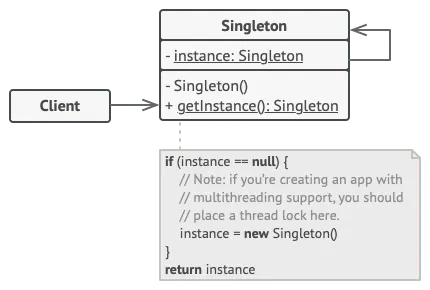

# Singleton Pattern

> Singleton is a creational design pattern, which ensures that only one object of its kind exists and provides a single point of access to it for any other code.

It is particularly useful when you want to ensure that a class has only one instance throughout the application’s lifecycle. This can be valuable in scenarios where you need a single point of control, such as managing configurations, database connections, or logging services.

In essence, a Singleton pattern restricts the instantiation of a class to a single object. This means that regardless of how many times the code requests an instance of the class, it will always receive the same instance. Think of it as a gatekeeper for ensuring that a particular class remains unique and unified throughout an application.

This uniqueness can prove to be incredibly valuable when dealing with resources that need to be shared across different parts of the codebase. The Singleton pattern’s primary goal is to provide a single point of access to that single instance, simplifying the process of managing shared resources, centralizing control, and promoting consistency in behavior.

> **The Core Idea:** "A class should have only ONE instance, and that instance should be accessible globally throughout the program."

> **The problem it solves:** imagine a Database Connection. If every part of your app creates a new DB connection, you'll have 100s of open connections — wasteful and dangerous. Singleton ensures everyone shares the exact same one.

### Idea of Singleton

- Singleton pattern = only one object of a class in the whole program.

- Whenever you “create” it, you always get the same single instance.

- Plus, there is one common way to access it (a global‑like access point).

Use‑cases people usually mention: logging, configuration, connection manager.

### Problem

The Singleton pattern solves two problems at the same time, violating the Single Responsibility Principle:

1. Ensure that a class has just a single instance. Why would anyone want to control how many instances a class has? The most common reason for this is to control access to some shared resource—for example, a database or a file.

    Here’s how it works: imagine that you created an object, but after a while decided to create a new one. Instead of receiving a fresh object, you’ll get the one you already created.

    Note that this behavior is impossible to implement with a regular constructor since a constructor call must always return a new object by design.

2. Provide a global access point to that instance. Remember those global variables that you (all right, me) used to store some essential objects? While they’re very handy, they’re also very unsafe since any code can potentially overwrite the contents of those variables and crash the app.

    Just like a global variable, the Singleton pattern lets you access some object from anywhere in the program. However, it also protects that instance from being overwritten by other code.

    There’s another side to this problem: you don’t want the code that solves problem #1 to be scattered all over your program. It’s much better to have it within one class, especially if the rest of your code already depends on it.

### Solution

All implementations of the Singleton have these two steps in common:

- Make the default constructor private, to prevent other objects from using the new operator with the Singleton class.

- Create a static creation method that acts as a constructor. Under the hood, this method calls the private constructor to create an object and saves it in a static field. All following calls to this method return the cached object.

If your code has access to the Singleton class, then it’s able to call the Singleton’s static method. So whenever that method is called, the same object is always returned.

## Structure of Factory Method



The Singleton class declares the static method getInstance that returns the same instance of its own class.

The Singleton’s constructor should be hidden from the client code. Calling the getInstance method should be the only way of getting the Singleton object.

## Step-by-Step Structure in Python

| Component                       | What it is                                        | Simple meaning            |
| ------------------------------- | ------------------------------------------------- | ------------------------- |
| Private constructor             | Prevents ClassName() from making multiple objects | "Block direct creation"   |
| Static/class variable _instance | Holds the one and only instance                   | "The saved single object" |
| __new__ method                  | Controls object creation in Python                | "The gatekeeper"          |
| Global access point             | The method/property that returns the instance     | "One door to enter"       |

**Step 1 — Basic Singleton using __new__**

```python
class Singleton:
    _instance = None   # 👈 Stores the single instance

    def __new__(cls):
        if cls._instance is None:          # First time? Create it
            cls._instance = super().__new__(cls)
        return cls._instance               # Always return same object

# Usage
s1 = Singleton()
s2 = Singleton()

print(s1 is s2)        # True ✅ — same object!
print(id(s1) == id(s2))  # True ✅ — same memory address!
```

Every call to Singleton() returns the exact same object from memory.

**Step 2 — Singleton with Data (Real Use Case — Logger)**

```python
class Logger:
    _instance = None

    def __new__(cls):
        if cls._instance is None:
            cls._instance = super().__new__(cls)
            cls._instance.logs = []   # 👈 Initialize only ONCE
        return cls._instance

    def log(self, message):
        self.logs.append(message)
        print(f"[LOG]: {message}")

# Usage
logger1 = Logger()
logger2 = Logger()

logger1.log("App started")
logger2.log("User logged in")

print(logger1.logs)   # ['App started', 'User logged in']
print(logger1 is logger2)  # True ✅
```

Even though logger1 and logger2 look like different objects, they share the same log list because they're the same instance.

**Step 3 — Thread-Safe Singleton**

In multi-threaded apps, two threads can both pass the if _instance is None check at the same time and create two instances — breaking Singleton. Fix it with a lock:

```python
import threading

class ThreadSafeSingleton:
    _instance = None
    _lock = threading.Lock()   # 👈 Only one thread enters at a time

    def __new__(cls):
        with cls._lock:            # Acquire lock
            if cls._instance is None:
                cls._instance = super().__new__(cls)
        return cls._instance

s1 = ThreadSafeSingleton()
s2 = ThreadSafeSingleton()
print(s1 is s2)  # True ✅ even in multi-threaded environments
```

**Step 4 — Singleton using Decorator (Pythonic Way)**

```python
def singleton(cls):
    instances = {}
    def get_instance(*args, **kwargs):
        if cls not in instances:
            instances[cls] = cls(*args, **kwargs)
        return instances[cls]
    return get_instance

@singleton
class DatabaseConnection:
    def __init__(self):
        self.connection = "Connected to DB"

db1 = DatabaseConnection()
db2 = DatabaseConnection()
print(db1 is db2)  # True ✅
```

what is happening in background:

``` text
instances
    │
    ▼
DatabaseConnection ───► Object A
                           ▲
                           │
                      db1  db2
```

**Step 5 — Singleton using Metaclass**

```python
class SingletonMeta(type):
    _instances = {}

    def __call__(cls, *args, **kwargs):
        if cls not in cls._instances:
            cls._instances[cls] = super().__call__(*args, **kwargs)
        return cls._instances[cls]

class Config(metaclass=SingletonMeta):
    def __init__(self):
        self.theme = "dark"

c1 = Config()
c2 = Config()
print(c1 is c2)  # True ✅
```